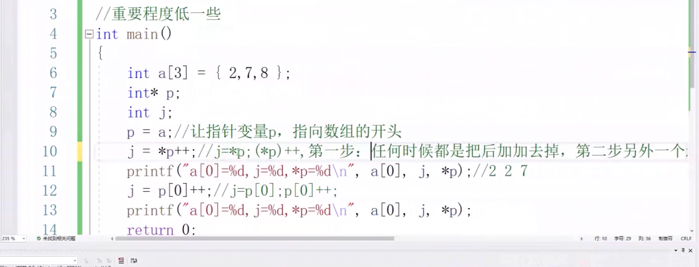
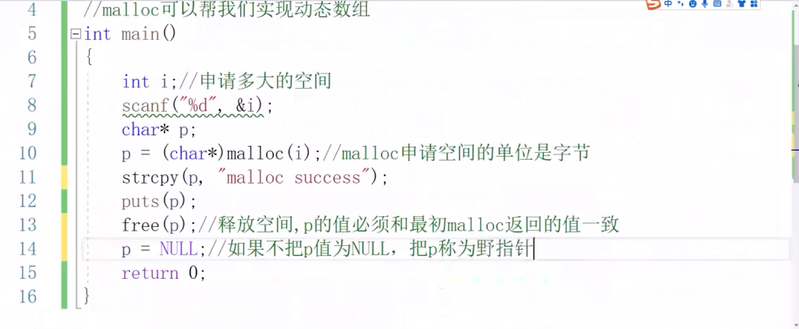
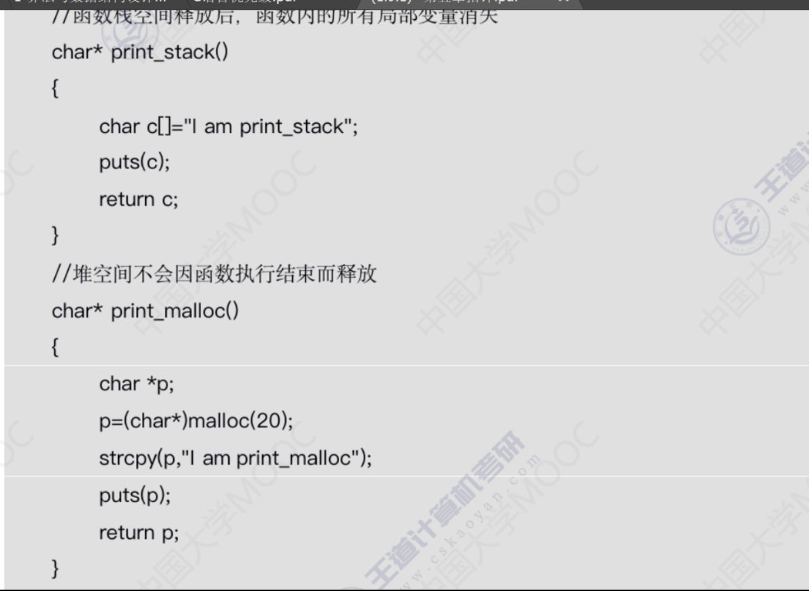
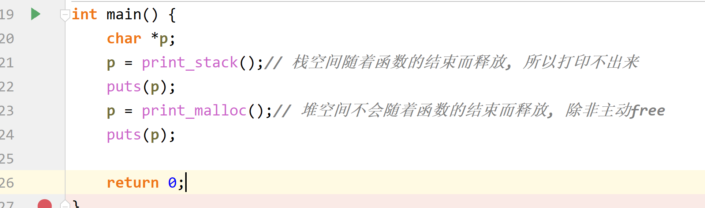
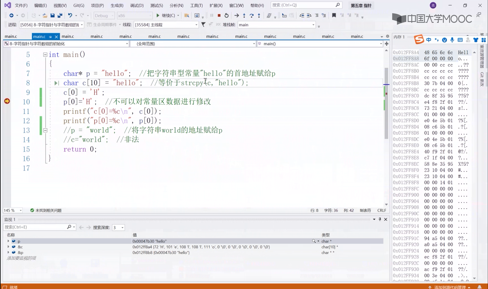
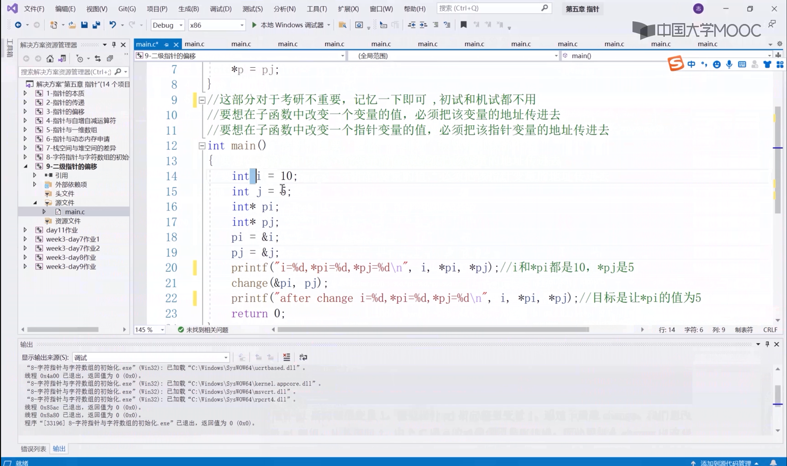
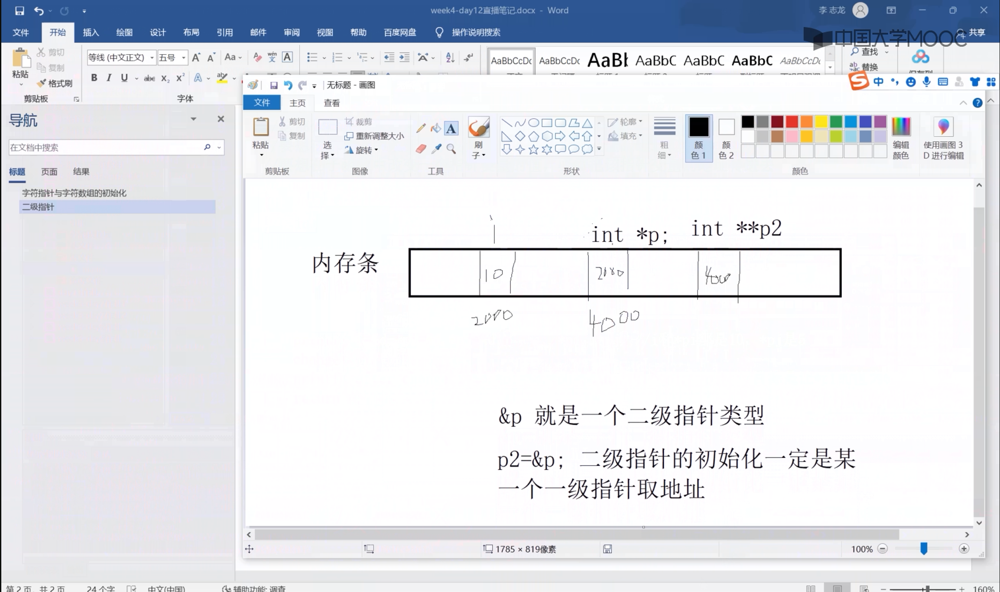

# 0x_ *p++

# 06, 指针与动态内存分配	

栈的效率比较高, 自动

堆要DIY,像图书馆, ==申请后要释放==

### 释放空间, p不能偏移

### 野指针, free后要把p = NULL

# 07_栈和堆空间的区别

# 08_字符指针和字符数组的初始化

字符指针指向数据区的字符串常量区, 字符数组(不可改变的(常量)指针)相当于strcpy了一份

# 09_二级指针的偏移

